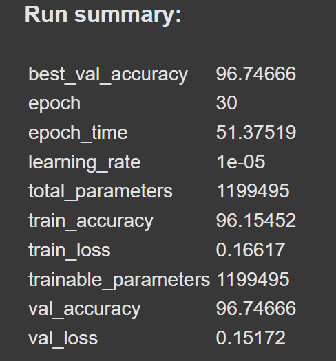

# Facial-Expression-Recognition

თავიდან გავუშვი მარტივი მოდელი რო მენახა რამდენად ხდებოდა ოვერფიტი. ერთ ლეიერიანი არქიტექტურა მქონდა და 1000 სემფლი ავიღე რომ მალევე გასულიყო ოვერფიტზე. ასეც მოხდა:  (ლინკი: https://wandb.ai/nkikn21-free-university-of-tbilisi-/facial-expression-recognition/runs/67a76jgl?nw=nwusernkikn21). 

მეორე არქიტექტურას უბრალოდ ერთი კონვოლუციური ლეიერი დავუმატე და ისევ ოვერფიტზე გავიდა ცხადია:  (ლინკი:https://wandb.ai/nkikn21-free-university-of-tbilisi-/facial-expression-recognition/runs/3mtiyypo). 

შემდეგი ვცადე 4 ლეიერიანი არქიტექტურა მაქსპულით. ამანაც საკმაოდ გაუტია ოვერფიტისკენ - . 

ამდენი ოვერფიტის მერე გავართულე ნელნელა და batchnorm დავამატე, ოღონდ ჯერჯერობით მარტო ეს, მერე დროფაუთსაც დავამატებ და რეგულარიზაციასაც. ასევე შევცალე batchsize 128-ზე და ეპოქები ძაან ბევრი იყო და 20 ზე დავწიე და learning-rate-ც 0.01 ზე დავაყენე.    ისევ ოვერფიტში წავიდა...
ამიტო ეხლა მართლა დავამატებ ბევრ რამეს რო ვუშველო რამე.

ამ batchnorm-ის ლეიერებს დავუმატე რეგულარიზაცია ვეითებისთვის და აუგმენტაცია, ანუ ფოტოების ჰორიზონტალურად და-flip-ვა და რენდომულად 10 გრადუსით ცვლა. ამ შემთხვევაში საბოლოოდ ისე მოხდა, რო ვალიდაციაზე ცოტათი უკეტესი შედეგი ქონდა ვიდრე ტესტზე...
რაც ცხადია არ არის კარგის მანიშნებელი    ლინკი:  https://wandb.ai/nkikn21-free-university-of-tbilisi-/facial-expression-recognition/runs/inj4go8y 

